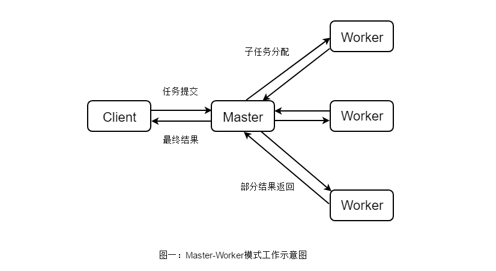

### 深入浅出Node笔记
#### 第一章：介绍Node
- 1.2.1 Node设计目标：一个基于事件驱动、非阻塞I/O的Web服务器，以达到更高的性能、提供Apache等服务之外的选择。
- 1.3 Node给JavaScript带来的意义： 
  - 浏览器中除了V8作为JavaScript引擎外，还有一个WebKit布局引擎。
  - 除了HTML、WebKit和显卡这些UI相关的技术之外，Node结构与Chrome十分相似。它们都是基于事件驱动的异步架构，浏览器通过事件驱动来服务界面的交互，Node通过事件驱动来服务I/O
  - 在Node中，JavaScript可以随心所欲的访问本地文件，可以搭建WebSocket服务器，可以连接数据库，可以如Web Workers一样玩转多进程。
  - Node不处理UI，但用于浏览器相同的机制和原理运行。前后端编程环境统一，可以大大降低前后端转换所需要的上下文交换代价。
  - 在node-webkit项目中，它将Node中的事件循环和WebKit的事件循环融合在一起，既可以通过它享受HTML、CSS带来的UI构建，也能通过它访问本地资源，将两者的优势整合到一起。桌面应用程序的开发可以完全通过HTML、CSS、JavaScript完成。用node-webkit构建桌面应用的项目有：Electron、NW.js。
- 1.4 Node的特点：保留了前端浏览器JavaScript中那些熟悉的接口，没有改写语言本身的任何特性，依旧基于作用域和原型链。
- 1.4.1 异步I/O
  - 在底层构建了很多异步I/O的API，从文件读取到网络请求。意义在于，在Node中，可以从语言层面自然地进行并行I/O操作。每个调用之间无须等待之前的I/O调用结束。在编程模型上可以极大提升效率。
- 1.4.2 事件与回调函数
  - 事件编程具有轻量级、松耦合、只关注事务点等优势，但是在多个异步任务的场景下，事件与事件之间各自独立，如何协作是个问题。
  - 回调函数无处不在的原因，是因为在JavaScript中，我们将函数作为一等公民来对待，可以将函数作为对象传递给方法作为实参进行调用。
  - 通过对业务的划分和事件的提炼，在流程控制方面处理业务的复杂度与同步方式实际是一致的。
- 1.4.3 单线程
  - 单线程最大好处是不用像多线程编程那样处处在意状态的同步问题，这里没有死锁的存在，也没有线程上下文交换所带来的的性能开销。
  - 单线程的弱点具体有以下三个方面：
    1. 无法利用多核CPU。
    2. 错误会引起整个应用退出，应用的健壮性值得考验。
    3. 大量计算占用CPU导致无法继续调用异步I/O。
  - 像浏览器中JavaScript以UI共用一个线程一样，JavaScript长时间执行会导致UI的渲染和响应被中断。在Node中，长时间的CPU占用也会导致后续的异步I/O发不出调用，已完成的异步I/O的回调函数也会得不到及时执行。
  - Web Worker能够创建工作线程来进行计算，以解决JavaScript大计算阻塞UI渲染的问题。工作线程为了不阻塞主线程，通过消息传递的方式来传递运行结果，这也使得工作线程不能访问到主线程中的UI。
  - Node采用了Web Workers相同的思路来解决单线程中大计算量的问题：child_process。
  - 通过将计算分发到各个子进程，可以将大量计算分解掉，然后再通过进程之间的事件消息来传递结果，这可以很好地保持应用模型的简单和低依赖。通过Master-Worker的管理方式，也可以很好地管理各个工作进程，以达到更高的健壮性。
  - Master-Worker模式是常用的并行模式之一。它的核心思想是，系统由两类进程协作工作：Master进程和Worker进程。Master进程负责接收和分配任务，Worker进程负责处理子任务。当各个Worker进程将子任务处理完成后，将结果返回给Master进程，由Master进程做归纳和汇总，从而得到系统的最终结果，其处理过程如图1所示。
  
  - Master-Worker模式的好处，它能够将一个大任务分解成若干个小任务，并且执行，从而提高系统的吞吐量。而对于系统请求者Client来说，任务一旦提交，Master进程会分配任务并立即返回，并不会等待系统全部处理完成后再返回，其处理过程是异步的。因此Client不会出现等待现象。
- 1.4.4 跨平台
  兼容Windows和*nix平台主要得益于Node在架构层面的改动，它在操作系统与Node上层模块之间构建了一层平台层架构，即libuv。
- 1.5.1 I/O密集型
  Node擅长I/O密集型的应用场景，能够有效地组织更多的硬件资源，提供更好的服务，I/O密集的优势主要在于Node利用事件循环处理能力，不是启动线程服务，资源占有少。
- 1.5.2 是否不擅长CPU密集型业务
  - CPU密集型应用给Node带来的挑战主要是：由于JavaScript单线程的原因，如果长时间运行计算（比如大循环），将会导致CPU时间片不能释放，使得后续I/O无法发起。但是适当的调整和分解大型运算任务微多个小任务，使得运算能够及时释放，不阻塞I/O调用的发起，这样既可以同时享受到并行异步I/O的好处，又能充分利用CPU。
  - 关于CPU密集型应用，Node的异步I/O已经解决了在单线程上CPU与I/O之间阻塞无法重叠利用的问题，I/O阻塞造成的性能浪费远比CPU的影响小。
  - Node虽然没有提供对多线程的计算支持，但是可以通过以下两种方式充分利用CPU：
    1. Node可以通过编写C/C++扩展方式更高效利用CPU，将一些V8不能做到性能极致的地方通过C/C++来实现。
    2. 如果单线程Node不能满足需求，甚至用C/C++扩展还觉得不够，可以通过子进程的方式，将一部分Node进程当做常驻服务进行计算，然后利用进程间消息传递，将计算与I/O分离，达到充分利用多CPU的目的。
- 1.5.3 Node的应用
  - 多应用做中间层，对接Java后端接口和中间件。
  - 前后端编程语言环境统一。
  - Node带来的高性能I/O用于实时应用。
  - 并行I/O使得使用者可以更高效地利用分布式环境。
  - 并行I/O，有效利用稳定提升Web渲染能力。
  - 云计算平台提供Node的支持。
  - 游戏开发领域。
  - 工具类应用。
#### 第八章：构建Web应用技术细节，如数据处理、路由、MVC、模板、RESTful等
- 8.1 基础功能
  - 请求方法的判断
  - URL的路径解析
  - URL中的查询字符串解析
  - Cookie的解析
  - Basic认证
  - 表单数据的解析
  - 任意格式文件的上传处理

- 8.1.1 请求方法
HTTP-Parser 请求方法存在于报文的第一行的第一个单词，通常是大写。在解析请求报文的时候，将报文头抽取出来，设置为req.method。
- 8.1.2 路径解析
HTTP-Parser 路径的部分存在于报文的第一行的第二部分，如下所示:
GET /path?foo=bar HTTP/1.1
- 8.1.3 查询字符串
  - 查询字符串位于路径之后，在地址栏中路径后的?foo=bar&baz=val字符串就是查询字符串
  - 这个字符串会跟随在路径后，形成请求报文首行的第二部分。这部分内容经常需要为业务逻辑所用，Node提供了queryString模块用于处理这部分数据，如下所示：
  
  ```
  var url = require('url');
  var queryString = require('queryString');
  var query = queryString.parse(url.parse(req.url).query);
  或者
  var query = url.parse(req.url, true).query
  {
    foo: 'bar',
    baz: 'val'
  }
  ```
- 8.1.4 Cookie
  1. 初始Cookie
  因为HTTP是无状态协议，现实中的业务却需要一定的状态，否则无法区分用户之间的身份。如何标识和认证一个用户，最早的方案就是Cookie了。
    Cookie的处理分为如下几步：
    - 服务器向客户端发送Cookie
    - 浏览器将Cookie保存
    - 之后每次浏览器都会将Cookie发向服务器端
  HTTP_Parser会将所有报文字段解析到req.headers上，那么Cookie就是req.headers.cookie。根据规范中的定义，Cookie值的格式是Key=value; key2=value2形式的，如果我们需要Cookie，解析它也十分容易。
  服务端告知客户端的方式是通过响应报文实现的，响应的Cookie值在Set-Cookie字段中。它的格式与请求中的格式不太相同，规范中对它的定义如下所示：
  Set-Cookie: name=value; Path=/; Expires=Sun, 23-Apr-23 09:01:35 GMT; Domain=.domain.com;
  其中name=value是必须包含的部分，其余部分解释可选参数。这些可选参数将会影响浏览器在后续将Cookie发送给服务端的行为。以下为主要的几个选项。
  - path表示这个Cookie影响到的路径，当前访问的路径不满足该匹配时，浏览器则不发送这个Cookie。
  - Expires和Max-Age是用来告知浏览器这个Cookie何时过期的，如果不设置该选项，在关闭浏览器时会丢失掉这个Cookie。如果设置了过期时间，浏览器将会把Cookie内容写入到磁盘中并保存，下次打开浏览器依旧有效。Expires的值是一个UTC格式的时间字符串，告知浏览器此Cookie何时将过期，Max-Age则告知浏览器此Cookie多久后过期。前者一般而言不存在问题，但是如果服务器端的时间和客户端的时间不能匹配，这种时间设置就会存在偏差。为此，Max-Age告知浏览器这条Cookie多久之后过期，而不是一个具体的时间点。
  - HttpOnly告知浏览器不允许通过脚本document.cookie去更改这个Cookie值，事实上，设置HttpOnly之后，这个值在document.cookie中不可见。但在HTTP请求的过程中，依然会发送这个Cookie到服务器端。
  - Secure。当Secure值为true时，在HTTP中是无效的，在HTTPS中才有效，表示创建的Cookie只能在HTTPS连接中被浏览器传递到服务器端进行会话验证，如果是HTTP连接则不会传递该信息，所以很难被窃听到。

  2. Cookie的性能影响
  由于Cookie的实现机制，一旦服务器端向客户端发送了设置设置Cookie的意图，除非Cookie过期，否则客户端每次请求都会发送这些Cookie到服务器端，一旦设置的Cookie过多，将会导致报头较大。大多数的Cookie并不需要每次都用上，因为这会造成带宽的部分浪费。
  - 减小Cookie的大小
  - 为静态组件使用不同的域名
  - 减少DNS查询
- 8.1.5 Session
  为了解决Cookie敏感数据的问题，Session应用而生。Session的数据只保留在服务器端，客户端无法修改，这样数据的安全性得到一定的保障，数据也无需在协议中每次每次都被传递。
  - 第一种：基于Cookie来实现用户和数据的映射
  - 第二种：通过查询字符串来实现浏览器端和服务器端数据的对应

  1. Session与内存
  为了解决性能问题和Session数据无法跨进程共享的问题，常用的方案是将Session集中化，将原本可能分散在多个进程里的数据，统一转移到集中的数据存储中。目前常用的工具是Redis、Memcached等。
  采用高速缓存的理由：
  - Node与缓存服务保持长连接，而非频繁的短连接，握手导致的延迟只影响初始化。
  - 高速缓存直接在内存中进行数据存储和访问。
  - 缓存服务通常与Node进程运行在相同的机器上或者相同的机房里，网络速度受到的影响较小。
  
  8.1.6 缓存
  为了提高性能，YSlow中也提到几条关于缓存的规则。
  - 添加Expires或Cache-Control到报文头中。
  - 配置ETags。
  - 让Ajax可缓存。
  如何让浏览器缓存我们的静态资源，这也是需要由服务器与浏览器共同协作完成的事情。通常来说，PUT、DELETE、PUT这类带行为性的请求操作一般不做任何缓存，大多数缓存只应用在GET请求中。
  缓存使用时间戳方式存在缺陷：
  - 文件的时间戳改动但内容并不一定改动。
  - 时间戳只能精确到秒级别，更新频繁的内容将无法生效。
  为此HTTP1.1中引入了ETag来解决这个问题。ETag的全称是Entity Tag，由服务器端生成，服务器端可以决定它的生成规则。如果根据文件内容生成散列值，那么条件请求将不会受到时间戳改动造成的带宽浪费。
  ```javascript
  var getHash = function(str) {
    var shasum = crypto.createHash('sha1');
    return shasum.update(str).digest('base64');
  }
  ```
  与If-Modified-Since/Last-Modified不同的是，ETag的请求和响应式If-None-Match/ETag，如下所示：
  ```javascript
  var handle = function(req, res) {
    fs.readFile(filename, function(err, file) {
      var hash = getHash(file);
      var noneMatch = req.headers['if-none-match'];
      if (hash === noneMatch) {
        res.writeHeader(304, 'Not Modified');
        res.end();
      } else {
        res.setHeader('ETag', hash);
        res.writeHead(200, 'ok');
        res.end(file);
      }
    })
  }
  ```
  HTTP1.0时，在服务器端设置Expires可以告知浏览器要缓存文件内容，如下代码所示：
  ```
  var handle = function(req, res) {
    fs.readFile(filename, function(err, file) {
      var expires = new Date();
      expires.setTime(expires.getTime() + 10*365*24*60*60*1000);
      res.setHeader('Expires', expires.toUTCString());
      res.writeHead(200, 'ok');
      res.end(file);
    })
  } 
  ```
  Expires是一个GMT格式的时间字符串。浏览器在接到这个过期值后，只要本地还存在这个缓存文件，在到期时间之前它都不会再发起请求。
  但是Expires的缺陷在于浏览器与服务器之间的时间可能不一致，这可能会带来一些问题，比如文件提前过期，或者到期后并没有被删除。在这种情况下，Cache-Control以更丰富的形式，实现相同的功能，如下所示：
  ```javascript
  var handle = function(req, res) {
    fs.readFile(filename, function(err, file) {
      res.setHeader('Cache-Control', 'max-age=' + 10*365*24*60*60*1000);
      res.writeHead(200, 'ok');
      res.end(file);
    })
  }
  ```
  上面Cache-Control设置了max-age值，比Expires优秀在于，Cache-Control能够避免浏览器端与服务器端时间不同步带来的不一致性问题，只要出现类似倒计时的方式计算过期时间即可。
  8.1.7 Basic认证
  请求报头中：
  > 
    \> GET / http/1.1 
    \> Authorization: Basic dxNlcjpwYXNz
  在Basic认证中，它会将用户名和密码部分组合：username + ':' + password。然后进行Base64编码，如下所示：
  ```javascript
  var encode = function(username, password) {
    return new Buffer(username + ':' + password).toString('base64');
  }
  ```
  如果用户首次访问该网页，URL地址中也没有携带认证内容，那么浏览器会响应一个401未授权的状态码，如下所示：
  ```javascript
  function(req, res) {
    var auth = req.header['authorization'] || '';
    var parts = auth.split(' ');
    var method = parts[0] || ''; // Basic
    var encoded = parts[1] || ''; // dxNlcjpwYXNz
    var decoded = new Buffer(encoded, 'base64').toString('utf-8').split(':');
    var user = decoded[0]; // user
    var pass = decoded[1]; // pass
    if (!checkUser(user, pass)) {
      res.setHeader('WWW-Authenticate', 'Basic realm="Secure Area"');
      res.writeHead(401);
      res.end();
    } else {
      handle(req, res);
    }
  }
  ```
  8.2 数据上传
  Node的http模块只对HTTP报文的头部进行了解析，然后触发request事件。如果请求中还带有内容部分（如POST请求，它具有报文和内容），
  内容部分需要用户自行接收和解析。通过报文的Transfer-Encoding或Content-Length即可判断请求中是否带有内容，如下所示：
  ```javascript
  var hasBody = function(req) {
    return 'transfer-encoding' in req.headers || 'content-length' in req.headers;
  }
  ```
  在HTTP_Parser解析报文头结束后，报文内容部分会通过data事件触发，我们只需以流的方式处理即可，如下所示：
  ```javascript
  function(req, res) {
    if (hasBody(req)) {
      var buffers = [];
      req.on('data', function(chunk) {
        buffers.push(chunk);
      });
      req.on('end', function() {
        req.rawBody = Buffer.concat(buffers).toString();
        handle(req, res);
      })
    } else {
      handle(req, res);
    }
  }
  ```
  将接收到的Buffer列表转化为一个Buffer对象后，再转换为没有乱码的字符串，暂时挂置在req.rawBody处。
  8.2.1 表单数据
  ```html
  <form action="/upload" method="post">
    <label for="username">Username:</label>
    <input type="text" name="username" id="username"/>
    <br/>
    <input type="submit" name="submit" value="Submit" />
  </form>
  ```
  默认的表单提交，请求头中的Content-Type字段值为application/x-www-form-urlencoded，如下所示：
  Content-Type: application/x-www-form-urlencoded
  ```javascript
  var hanlde = function(req, res) {
    if (req.headers['content-type'] === 'application/x-www-form-urlencoded') {
      res.body = queryString.parse(req.rawBody);
    }
    todo(req, res);
  }
  ```
  后续业务中直径访问req.body就可以得到表单中提交的数据
  8.2.2 其他格式
  ```javascript
  var mine = function(req) {
    var str = req.headers['content-type'] || '';
    return str.split(';')[0];
  }
  ```
  1.JSON文件
  如果从客户端提交JSON内容，这对于Node来说，要处理它不需要额外的任何库，如下所示：
  ```javascript
  var handle = function(req, res) {
    if (mine(req) === 'application/json') {
      try {
        req.body = JSON.parse(req.rawBody);
      } catch (e) {
        // 异常内容，响应Bad request，
        res.writeHead(400);
        res.end('Invalid JSON');
        return;
      }
    }
    todo(req, res);
  }
  ```
  2.XML文件
  解析XML文件，社区的xml2js模块支持XML文件转JSON对象
  ```javascript
  var xml2js = require('xml2js');
  var handle = function(req, res) {
    if (mime(req) === 'application/xml') {
      xml2js.parseString(req.rawBody, function(err, xml) {
        if (err) {
          // 异常内容，响应Bad request
          res.writeHead(400);
          res.end('Invalid XML');
          return;
        }
        req.body = xml;
        todo(req, res);
      })
    }
  }
  ```
  8.2.3 附件上传
  在前端HTML代码中，特殊表单与普通表单的差异在于该表单中可以含有file类型的控件，以及需要指定表单属性enctype为multipart/form-data，如下所示：
    ```html
  <form action="/upload" method="post">
    <label for="username">Username:</label><input type="text" name="username" id="username"/>
    <label for="username">Filename:</label><input type="file" name="file" id="file"/>
    <br/>
    <input type="submit" name="submit" value="Submit" />
  </form>
  ```
  浏览器在遇到multipart/form-data表单提交时，构造的请求报文与普通表单完全不同。
  Content-Type: multipart/form-data; boundary=AaB03x
  Content-Length: 18231
  由于是文件上传，接受大小未知的数据量时，我们需要十分谨慎。
  ```javascript
  function(req, res) {
    if (hasBody(req)) {
      var done = function() {
        handle(req, res);
      };
      if (mime(req) === 'application/json') {
        parseJSON(req, done);
      }
      else if (mime(req) === 'application/xml') {
        parseXML(req, done);
      }
      else if (mime(req) === 'multipart/form-data') {
        parseMultipart(req, done);
      }
    } else {
      handle(req, res);
    }
  }
  ```
  formidable模块基于流式处理解析报文，将接受到的文件写入到系统的临时文件中，并返回对应的路径，如下所示：
  ```javascript
  var formidable = require('formidable');
  function parseMultipart(req, res) {
    if (hasBody(req)) {
      if (mime(req) === 'multipart/form-data') {
        var form = new formidable.IncomingForm();
        form.parse(req, function(err, fields, files) {
          req.body = fields;
          req.files = files;
          handle(req, res);
        })
      }
    } else {
      handle(req, res);
    }
  }
  ```